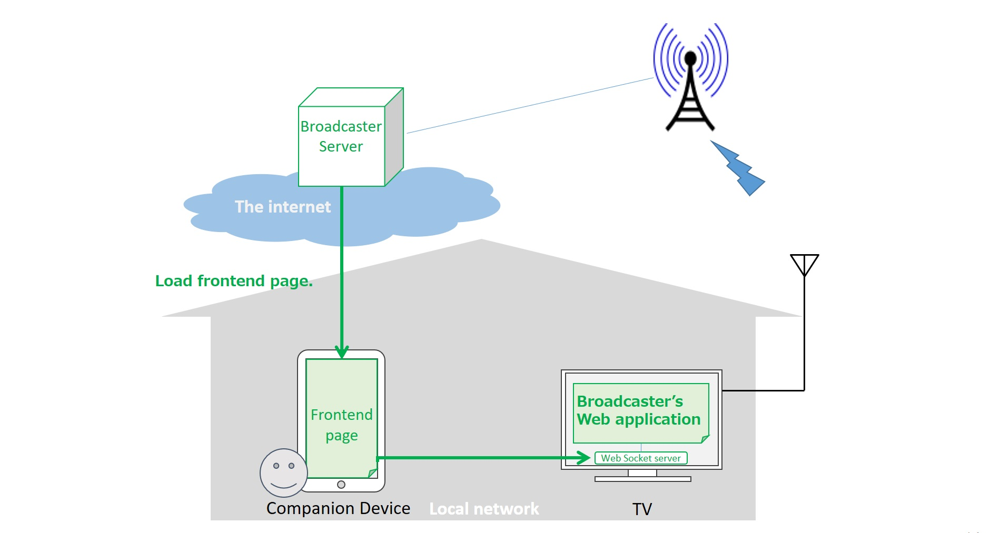
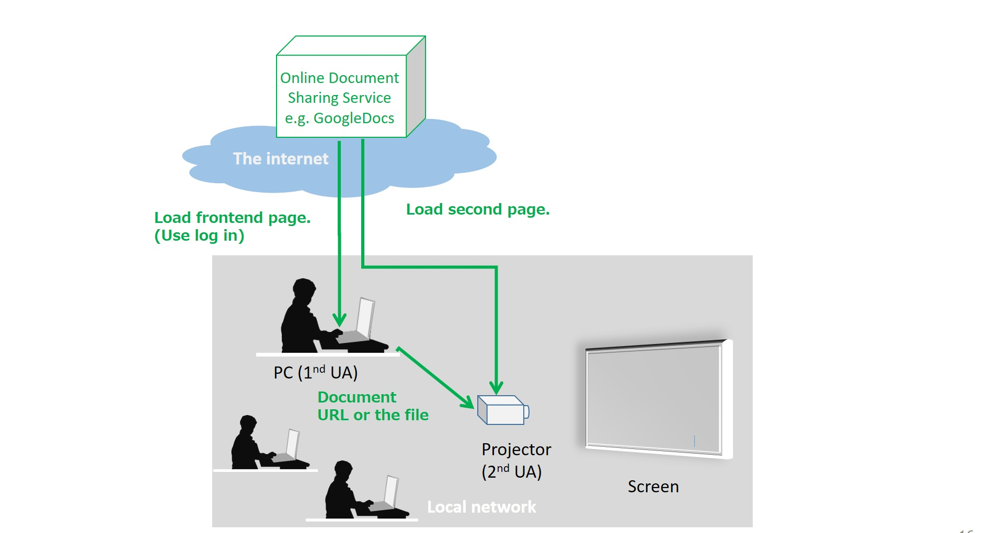

# Use Cases of HTTPS/WSS in Local Network

This document describes use cases where browsers communicate with web-server-capable devices in local network via HTTP and/or WebSocket over TLS.
These use cases are intended to clarify requirements in terms of network (topology, protocol, etc.) and security
(privacy concern, issuing a certificate, validation, etc.).

## UC-01: Access audio contents in a home storage device from a cloud service

Users can store their audio contents in their storage device, or set-top boxes, in their home.
They access online music web services with web browsers, and use a music player implemented as a web application
in the web services to play music stored in their home network.
The music player send metadata of the music to the web service, to recommend another music contents.

## UC-02: Video streaming with cache storage in local network

A user has a video cache server appliance in her home for enjoying high-quality (e.g. 4K) online video streaming services.
She enters an online video streaming service by using a browser on her TV.
The streaming service finds her cache server appliance through the browser and shows her the appliance via a popup window.
She selects the appliance and allows the service to use it as cache storage for high-quality video streaming.
After her approval, the service can cache 4K movies purchased by her (or put into her watch-list, etc.) in the appliance.
The video caching can be done by the frontend of the service loaded on the browser or by the appliance itself.
When she wants to watch one of the movies cached in the appliance, the online service fetch the movie from the appliance directly.
She can watch the movie comfortably (e.g. without causing stalls) regardless of the condition of the internet.

## UC-03: Web-based UI for home appliances (input/output constrained devices)

A user controls home appliances (e.g. air conditioner, microwave oven, refrigerator) with an online GUI service on the internet.
The home appliances are designed natively to be used via the online GUI loaded in a browser on her smartphone or tablet.
As with the use cases mentioned above, when she signs in to the online service, the service finds a home appliance through the browser.
Under her approval, the service can be granted access privileges for the appliance and she can control it through the GUI service.

## UC-04: Embedded system monitoring and controlling for display-capable devices

A field engineer of a digital signage service provider sets up an internet-capable display device.
The engineer makes the device display a specific website as a signage content by using a browser on the device.
After that, the website is monitoring the status of the embedded system (e.g. collecting logs, monitoring system resource utilization)
continuously via the browser by using internal REST APIs provided by an internal web server (e.g. https://localhost) of the device.
If the device provides the website with reboot functionality as one of the REST APIs, the service provider is able to not only check
the health of the device, if necessary, but also reboot the device remotely via the website.

## UC-05: Data analysis from analytical and measuring instruments in local network

An analytical and measuring instrument in local network outputs a large amount of raw data as the result of an experiment.
An experimenter (a user of the instrument) signs in to a web-based analytical service provided by the vender of the instrument by using a browser in her PC.
The experimenter analyzes the raw data by using the web service and the service fetches the raw data from the instrument directly in local network.

## UC-06: Photo sharing between online services and home NAS devices

A user usually stores her private photos and videos in a home NAS device.
She opens an online photo sharing service in a browser on her smartphone.
The online service finds her home NAS device through the browser and shows her the NAS via a popup window.
She selects the NAS and the browser shows her private photos in the NAS as well as the ones already stored in the online service.
She then selects and posts some photos that she would like to share with her friends or,
if she usually posts photos to the online service from her smartphone directly, she downloads the photos and posts them to the NAS device.

## UC-07: Secure offline communication for home automation

A user sets up a home automation gateway is under normal circumstances using HTTPS to securely accept commands via a remote server.
In some cases the gateways internet connection is interrupted but local communication between a wall mounted control surface, app, or similar should stil be given.
This becomes very important when we consider that devices that can be controlled this way include door locks and security cameras.

## UC-08: Companion Device for Broadcast Interactive Service

A user is watching a broadcast interactive service which is enhanced by a broadcaster’s web app running on the user agent of TV. The user hands a companion device, e.g.  Smartphone, and launches a user agent with the Frontend page from the broadcaster web server. The Frontend page discovers the user-agent of TV and securely communicates with the broadcaster’s web application via the Web Socket Server on TV in order to provide GUI for the interactive broadcast service. Note that this use case is similar to the 2-UA of the Presentation API but the difference is that the broadcaster’s web application on TV is running on UA of TV in advance.

## UC-09: Presenting with Projector at office

A user is attending a meeting at office (outside home). The user logs on an online document sharing service on PC and present his document file on the service with the Projector connected via local network. FrontEnd page on UA1 at PC initiates to launch 2nd frontend page on 2nd UA at the projector to let the 2nd frontend page present the document.  Note that this use case is similar to 2-UA of Presentation API but the communication between 2-UA should be secured to prevent the MITM attack in the local network and also the regular WebSocket API is used for the communication, e.g. file transfer.

# Requirements for HTTPS/WSS in Local Network

This section collects requirements derived from use cases listed above.

## REQ-01: Device Discovery

- The UA (the web browser mentioned in the use cases above) shall be able to securely discover the presence of HTTPS/WSS server capable devices (hereinafter just called 'device') that are connected to the local network.
- A secure context loaded from the internet to the UA (hereinafter just called 'secure context') should also be able to discover target device capabilities that are actively (e.g., turned on) connected to the local network (e.g., device type, identity of a set of Web APIs, and so on).
- A secure context shall be able to get access to the locally discovered device based on the user consent.
- If there are multiple devices in local network, the UA shall be able to provide the user with a way to select one device at a time which she intends to use on the secure context.
- The list of devices in local network must not be exposed directly to web applications. The UA must provide web applicatons with only information or interface related to the device selected by a user.
- etc.

## REQ-02: Mutual authentication between device and secure context

- The secure context must have a way to verify whether the device to which it tries getting access is reliable or not.
- The device should have a way to verify whether the origin of the secure context which tries getting access to the device is reliable or not.
- etc.

## REQ-03: Issuing TLS server certificate for device

NOTE: Are there any solution to realize the use cases above without issuing a TLS server certificate to the device ?

- The device must have a way to get a server certificate which the UA can trust after connecting to the local network because an IP address and a domain name of a device in local network is subject to change.
- The device must have a way to verify the server certificate issuer’s trust.
- A server certificate issuer for devices (hereinafter called 'Device CA') must have a way to verify whether the target device is eligible for having a server certificate or not.
- The device should have a cryptographically secure way to keep the private key of the server certificate secret.
- The server certificate for the device should be issued without manual configuration by the user because local network (e.g., home network, small office network) usually does not have any network administrators.
- etc.

## REQ-04: Cross-origin access from secure context to device

- The UA shall be able to allow secure contexts to get access to HTTPS/WSS server capable devices in local network based on user granting authorization to the device.
- The device in local network should be able to accept access requests from secure contexts based on user granting authorization.
- etc.

## REQ-05: Managing (reissuing and revoking) TLS server certificate for device

NOTE: There haven't been use cases for the requirements yet but we will have to discuss this topic eventually.

- The UA shall be able to revoke access privilege for the secure context to the device if the user decides to do that.
- The UA should be able to revoke access privilege for the secure context to the device if the UA finds out the device has already become insecure, is malicious or is vulnerable (based on user granting authorization).
- etc.
